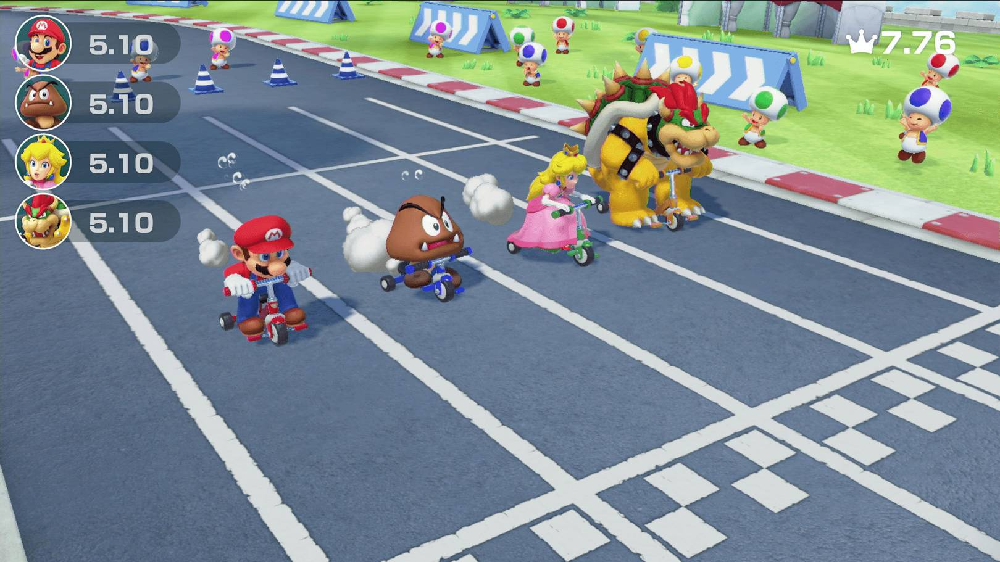
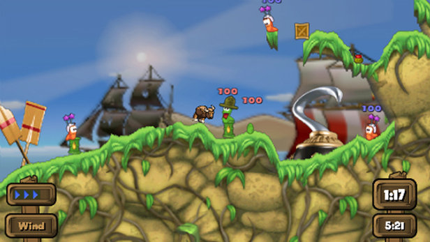
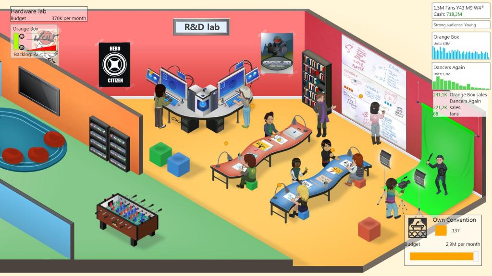

Introduction
============

Ce document est une **proposition** du concept **ZGame**. Ce n'est qu'un support de **discussion** si ce projet vous intéresse.
Tous les points sont uniquement des propositions et ne demandent qu'à être discutés et améliorés à plusieurs! **Bonne lecture**!

Concept
=======

Le but du concept est de réaliser un **jeu vidéo**, ou une partie, pendant le **ZEvent**.

Dans l'ideal, les **objectifs**, game designs, arts pourraient être **participatifs**, via la participation de streamers ou communauté.

En résumé, une sorte de **Game Jam** mixée avec un **Kickstarter** live.

Type de jeu
===========

Le type de jeu est à définir. Il faudrait un style assez **universel** mais avec un scope réduit afin de réduire le risque.

Si le style permet **d'étendre** le jeu simplement, une fois la base mise en place, c'est aussi un avantage.

Si le genre du jeu permet le multijoueur, il serait plus prudent de privilégier du **multi-joueur "local"**. Le multi joueur "online" demandant en général
beaucoup plus de support, sans réel choix facile (P2P vs Gameservers), donc difficilement supportable dans un court laps de temps.

On pourrait envisager des **stretch goals** très élevés pour supporter le multijoueur, mais il faudra être vigilant afin de ne pas créer énormément de support une fois l'évènement terminé.
Des propositions qui correspondraient à ces critères sont:

* **Party** Games, mini game based
* **Couch** based
* **Meta**-Concept

Party Games, mini game based
----------------------------

Exemples: Mario Party, Fall Guys.

L'avantage de ce genre de jeu est la possibilité **d'étendre** le concept: ajouter de nouveaux **mini jeux**, personnages, skins, favorisant les dons/goals.
Un autre plus est la génération de **hype** grâce à la possibilité de faire tester les prototypes par les **streamers**.

L'inconvenient est qu'il nécessite une bonne **préparation** pour être à l'aise dans la réalisation des **objectifs**/stretch goals.
Le plus sage est probablement de ne pas faire à 100% le jeu durant l'évènement, et bien préparer les **bases** en **amont**.

Couch based
-----------

Exemples: Towerfall, Overcooked, Worms

Si le **multi-joueur local** est choisit, ce concept est très ressemblant au précédent. La principale différence est l'expérience centrée sur **un seul
mode de jeu**.

L'avantage est un scope plus **maitrisable**.

L'inconvénient est donc une **extensibilité réduite**. Moins de leviers pour générer de la hype ou faire participer les streamers dans la réalisation.

Avec un concept original, ce style est quand même un bon **compromis** entre faisabilité et **"un souvenir du ZEvent"**.

Meta-Concept
------------

Si on veut tabler sur **l'identité** du **ZEvent**, un "méta-concept" est envisageable. 

Par exemple: "ZEvent simulator".

Le concept serait un **jeu de gestion** du type "GameDev Tycoon", "Startup Company".

Le but serait de mettre le joueur à votre place (Zerator, Dach, influenceurs), dans **l'organisation** de l'évènement.

Organisation de l'endroit, sélection de l'association, gestion des streamers ainsi que de leur fatigue, commandes au Mcdo, des raids, management de la hype, dons, évènements aléatoires à gérer.

Un bon travail de **préparation** dans la **conception** est nécessaire. Mais ce genre de jeu pourrait avoir une saveure et une implication particulière pour les joueurs. Un peu le jeu du **"j'y étais"** en quelque sorte.

Production
==========

L'idée de base est de conserver un **format** ressemblant à une **"GameJam"**.

La **core team** pourrait se composer de 4 ou 5 membres, probablement des **professionnels** du milieu ayant des profils pluridisciplinaires (**ninja**).

Par exemple: 2 programmeurs, 1 game designer, 1 artiste, 1 compositeur.

Pour maximiser la **productivité**, l'itération et se concentrer sur le jeu il faudrait choisir un **moteur existant** (par opposition à commencer "from scratch").
**Unreal Engine 4** ou **Unity** seraient de bons candidats (préférence personnelle pour UE4 (plus d'expérience), à voir selon le jeu et le profil de l'équipe).

La **plateforme** visée devrait probablement être **PC**. En effet, les moyens de distributions et les "requirements" pour "shipper" un jeu sur PC sont bien moins important que sur console.

Etant donné que l'audience du jeu est **grand public**, les joueurs ne seront probablement pas familier avec le format **"game jam"** et les attentes seront par conséquent **élevées** par rapport au **défis** de réaliser un jeu si vite.

Un **travail préparatoire** avant l'évènement pourrait donc aider à dérisquer les sujets techniques et concept.

Preparation
===========

La **période** de préparation est à définir en fonction du projet choisit et de l'emploi du temps des membres. Il est probablement prudent de commencer **plusieurs mois** à l'avance afin d'être solidement préparé le jour de l'évènement.

Cette préparation peut s'organiser de la manière suivante:

Recrutement de l'équipe
-----------------------

**A définir** selon le type de jeu, temps de préparation, ambitions. Des profils **pluridisciplinaire** ayant déjà "joué" avec des **moteurs modernes** seraient probablement un bon choix.

Choix des technologies et outils
--------------------------------

L'objectif est de bien sélectionner l'ensemble des **outils** permettant de gagner du **temps** ainsi que se faire une expérience afin d'être à l'aise pendant l'évènement.
Il est important de privilégier la capacité **d'itération** et le **debug**.

Mise en place d'un "toy"
------------------------

Un **Toy** est un prototype contenant les principaux concepts du futur jeu.

La réalisation d'un Toy **avant l'évènement** peut permettre à l'équipe de se familiariser avec les **concepts** du jeu, la **technologie** qu'ils montent, mais aussi à se heurter aux premiers problèmes non anticipés.

Un autre but est la réduction de **dépendances**. Il est par exemple important qu'un minimum de technologie et **pipeline** soit mis en place pour que chaque personne de **l'équipe** puisse être **autonome**.
Autrement dit, que tous le monde puisse avancer sans être en attente le jour de l'évènement.

Distribuer **l'ownership** des différentes fonctionnalités pendant la préparation peut aussi aider. Les premiers pas sont souvent les plus coûteux en terme de temps. Une fois qu'une personne est à l'aise dans son domaine, elle iterera beaucoup plus vite.

Ajustement des objectifs
------------------------

Une fois le Toy mis en place. L'équipe aura une meilleure idée de sa **capacité d'itération**. La finalisation des **objectifs** pour l'évènement et **stretch goals** pourront alors être définis avec plus de **confiance**.

Communication
=============

Plusieurs **options** sont possible. Etant donné votre grande expérience dans le domaine, voici quelques propositions naïves, pouvant être remise en question.

La première option est de **streamer** le développement. N'ayant pas de réelle expérience dans le streaming et au vu du défi, cette proposition parrait trop ambitieuse, malgré l'intêret.

L'avantage est le côté **éducatif**, montrant la conception d'un mini jeu au public. De même, cette proposition offre plus d'occasions **d'impliquer** les viewers qui seraient à même de proposer de bonnes idées.

Une seconde option serait de faire quelques points **"fil rouge"**.

Pendant l'évènement, Zerator, Dach pourraient par exemple venir faire des **points**, tester le jeu, **impliquer** la communauté, décider des objectifs, animer, me faire crier dans le **mégaphone** etc.

Organisation des dons
=====================

Ce sujet dépend énormément du moyen de **distribution** du jeu, et devra faire l'objet de discussions. 

Un partenaire actif dans le milieu des associations, tel que **Humble Bundle**, pourrait par exemple être privilégié.

Une autre piste pourrait être la distribution par **Steam**. Mais une perte sèche de 30% des dons seraient alors à prévoir (marge de Steam).

Un axe important à définir est la **durée de vie** de la vente. Doit-on continuer de distribuer le jeu une fois **l'évènement terminé**?

Un système de **store** ou d'achats **in app** paraît extrêmement ambitieux. De plus il sera difficile de récolter des dons via l'achat de **skins** par exemple, car ces dons dépendraient de la sortie du jeu (en dehors de l'évènement?).

Le fait de laisser la possibilité aux **joueurs** de décider "à quel point ils **supportent** l'initiative", reste intéressante. Il faudra probablement creuser du côté de la mise en place de **DLC** ou différentes **version** du jeu.

Contact
=======

**Merci** d'être arrivé jusque ici! (et chay à moi sinon).
Si vous êtes intérêssés: luc.eygasier@gmail.com (ou via Dach).
