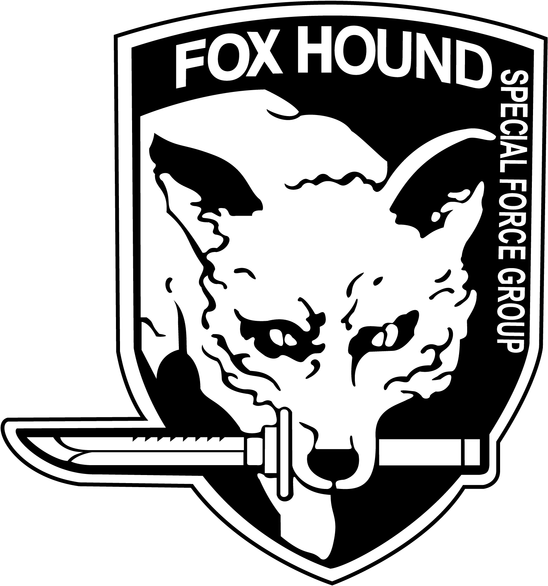
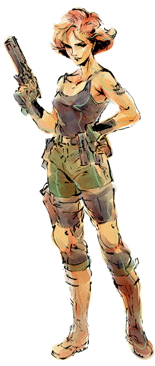
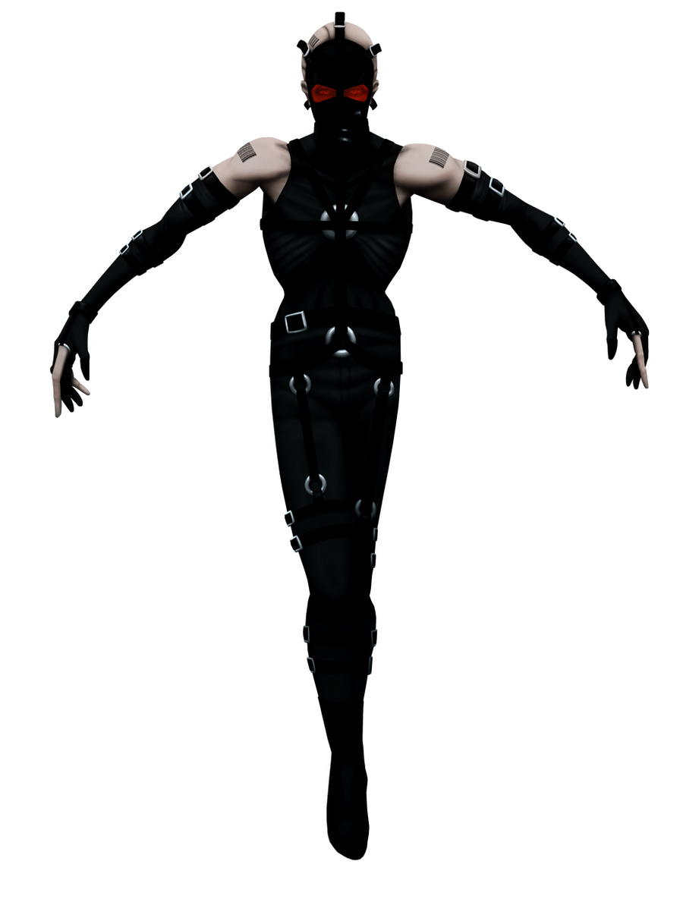
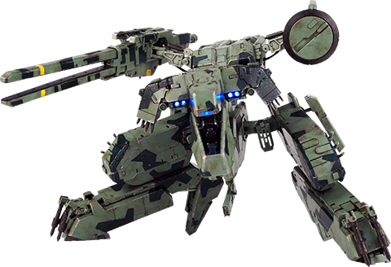

Introduction
============

Ce document a pour but de présenter et organiser l'opération **eNYK.MGS**.
Il a aussi pour but de formaliser un **template** d'opération, c'est à dire un document à améliorer pour aider préparer les prochaines opérations.
Il peut servir d'outil de communication, de **checklist**, ou autre.

Opération
=========

Concept
-------

Le concept de cette opération est de réaliser un **marathon** de MGS à deux. Il s'agit donc de **terminer MGS** en un nombre réduit de live, potentiellement un seul.

Date
----

Etant donné le caractère **long** du live, il faudrait probablement viser une **plage horraire large**, avec un créneau **accessible pour le grand public**.
Samedi 17-18h?

Ton
---

TODO(#eNYK): humoristique? Tryhard? équilibré?

Rythme
------

MGS offre une structure assez **linéaire**. Même si on n'a pas joué depuis longtemps, notre mémoire devrait suffire pour terminer le jeu.
Partant de ce principe, on pourrait tirer parti de la structure du jeu en **segments** infiltration-boss, pour déterminer le rythme du live.
Par exemple changer de joueur **après chaque boss**, de même pour faire des pauses. Le rythme sera néanmoins dépendant de la solution de **stream à plusieur** adopté.
En effet si "transmettre la manette", est trop **coûteux**, on pourrait vouloir limiter le geste.

Happening
---------

TODO(#eNYK): bait/prank pendant le live?

Acting scène à deux?

Périphérique
------------

Après tests, une manette **PS4** semble appropriée. Proche de la manette **PS1** pour la mémoire musculaire, moins de configurations requises que le combo clavier + souris.

Difficulté
----------

Le mode **Normal** est probablement le plus approprié.

Langue
------

Le jeu semble disponible seulement en **anglais**.

Retry/Gestion des alarmes
-------------------------

Afin de gagner du temps, il semble possible **d'abuser** du portage PC, c'est à dire **sauvegarder hors codec** souvent puis **charger en cas de fail**.

Cinématique/Codec
-----------------

**Jouer** les cinématiques. **S'adapter au public** pour le codec.

Style de jeu
------------

Furtif? Kill? Utilisation des armes?

Preparation
===========

Jouer à deux
------------

Sauvegarde grâce au portage PC (== hors codec). **Partage de compte GOG**, pour la synchronisation de sauvegarde.

Streamer à deux
---------------

A tester: https://obsproject.com/forum/resources/obs-studio-send-an-udp-stream-to-a-second-pc-using-obs.455/

Communication
=============

Twitter
-------

Date:
Contenu:

Discord
-------

Date:
Contenu:

Instagram
---------

Date:
Contenu:

Tiktok
------

Date:
Contenu:

Contenu Post Evenement
======================

Youtube
-------

Je dump le live en raw frère

Instagram
---------

Tiktok
------

